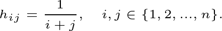

# libmatfile

*load from and save to mat-files*

## Overview

**libmatfile** is C library which allow to load array and matrices from or
store them into mat-file. This library was separated as isolated module during
[cutt](https://github.com/daskol/cutt) project development. It is implemented
specification of MAT-file format according to
[documentation](doc/matfile-format.pdf).

At the moment all features are not implemented yet. The list of capabilities
and their readiness is placed bellow.

- [x] Simple file loader.
- [ ] Streaming file loading.
- [ ] Simple file saver.
- [ ] Streaming file saving.
- [ ] Memory map support for large files.
- [ ] C++ wrapper and bindings to other languages if needed.
- [ ] MAT-file Level 4 support.

The list is not filled completely yet since library is under development and
not all API routines are stable.

## Usage

Suppose there is a mat-file which contains at least one matrix. The matrix is
The matrix is Hilbert if the following holds.



Maybe the matrix is adjacency matrix of social graph or item-feature matrix of
recommender system. In either case, we need to load the matrix and perform some
calculations.  There is an example of how to archive these things below.

```c
#include <matfile/matfile.h>

matfile_t *mat = matfile_read("arrays.mat");
const char **varnames = matfile_who(mat);

for (unsigned i = 0; varnames + i != NULL; ++i) {
    printf("[%03d] variable %s\n", varnames + i);
}

free((void *)varnames);

matfile_array_t *array = matfile_get_array(mat, "hilbert");
matfile_destroy(mat);
```

## Assembling

The build system used by libmatfile is CMake which is natural for C/C++
projects. In order to build release version one should run the following
commands in shell.

```bash
mkdir build
cd build
cmake ..
make
```

After compilation `libmatfile.a` or `libmatfile.so` depending on desired
linking mechanism appears in build directory. Moreover, there is doxygen
documentation in `doc/html/index.html` relative to build directory as well.
See details in [CMakeLists.txt](CMakeLists.txt).

## Credits

&copy; Daniel Bershatsky <<mailto:daniel.bershatsky@skolkovotech.ru>>, 2018
